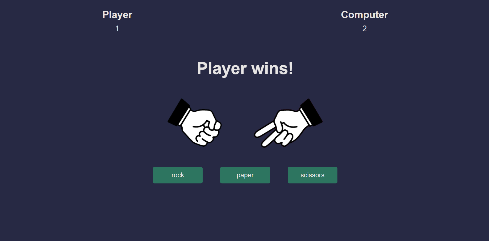

# rockpaperscissors
Rock-Paper-Scissors Game

This Rock-Paper-Scissors game is developed using HTML, CSS, Sass, and JavaScript. 
Players select either rock, paper, or scissors, while the computer randomly chooses its selection. 
The winner is determined based on the classic rules: rock beats scissors, scissors beats paper, and paper beats rock. 
In case both sides select the same item, the game results in a tie.

How to Play

Player's Turn: Choose your move by clicking on the respective option (rock, paper, or scissors).

Computer's Turn: The computer will randomly select its move.

Outcome: The winner is determined based on the classic rules mentioned above.

Ties: If both sides choose the same move, the game ends in a tie.

Installation
Clone this repository to your local machine using git clone.
Open the index.html file in a web browser.
